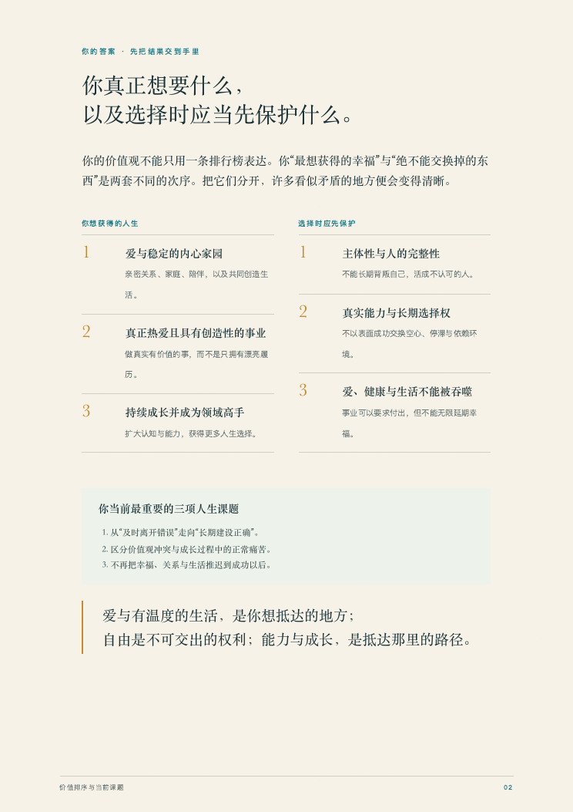
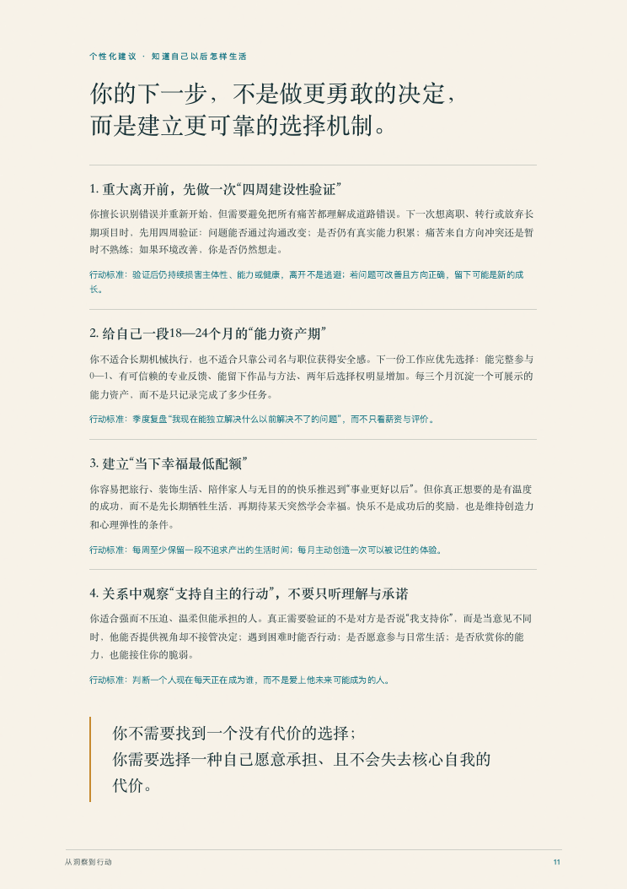
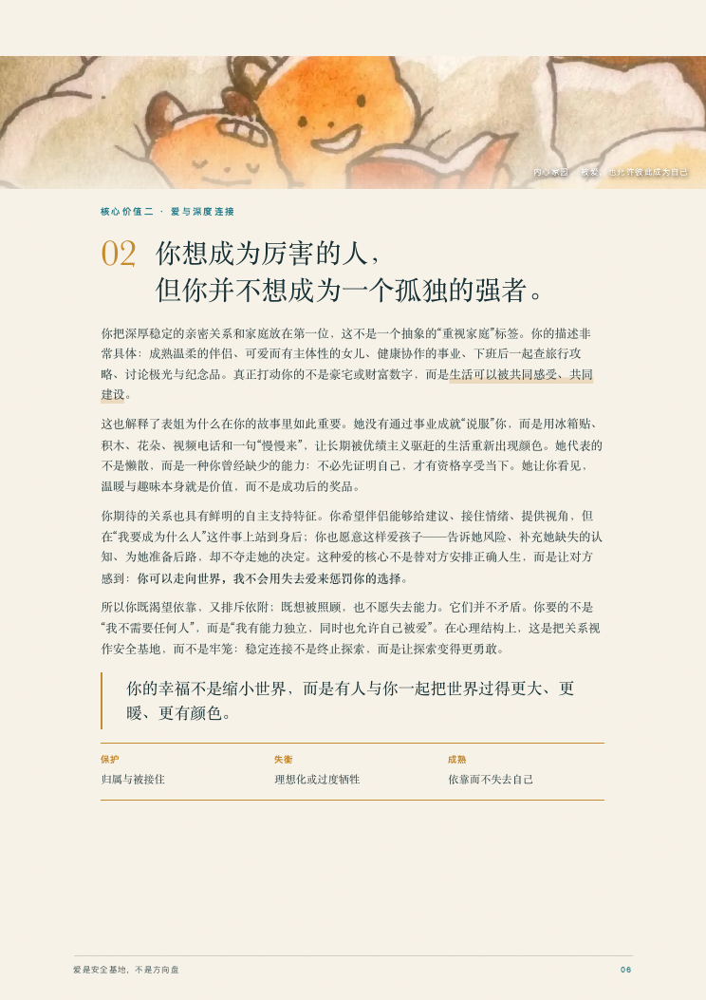
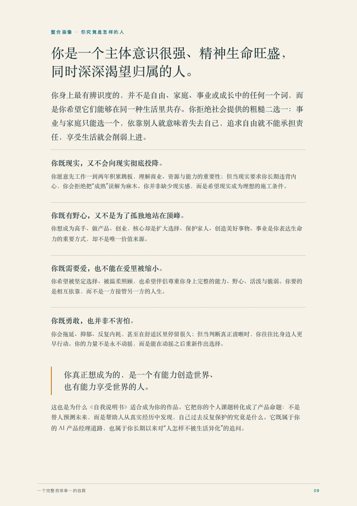

<div align="center">

# 人生选择辅助器｜《自我说明书》

### 花一晚，深度对谈，建立自己的个人说明书

**当你不知道该选择哪条路，真正缺少的也许不是更多建议，**  
**而是知道：什么样的人生，才值得你去过。**

通过深度访谈，从真实人生经历中提炼你的核心价值观，生成《自我说明书》，并据此辅助此后每一次重要选择。

</div>

<p align="center">
  
</p>

---

## 我们的一生，好像总在回答一些没有标准答案的问题

> 留在家乡，还是去大城市？  
> 继续一份稳定却不喜欢的工作，还是重新开始？  
> 要不要考研？要不要跨行？  
> 该选择什么专业？  
> 要不要结婚？要不要结束一段关系？

我们怕选错。

怕走错一步，满盘皆输；怕多年以后回头，发现自己一直在过一种并不想要的人生。

可很多时候，真正困住我们的不是选项太少，而是我们还不够了解自己。

我们知道什么工作更体面、哪条路更稳定、别人认为怎样的人生更成功，却很少认真问过：

> **如果放下外界的一切答案，我究竟想要什么？**

所有看似不同的人生选择，最后都在追问同一件事：

> **我的选择，应该符合怎样的人生？**

《自我说明书》想陪你找到的，不是某一道题的标准答案，而是一套属于你自己的选择坐标。

---

## 30–45 分钟以后，你会得到什么？

你得到的不是几句聊天总结，而是一份可以真正用于生活的《自我说明书》：

1. **你真正想获得的人生**：你想抵达的关系、事业和生活状态。
2. **选择时优先保护的原则**：即使付出代价，也不愿长期交出的东西。
3. **核心价值观 1、2、3**：每项都有只属于你的定义，而不是通用标签。
4. **你为什么会成为现在的你**：心理机制、保护作用与失衡风险。
5. **按优先级排列的行动建议**：每条都有原因、做法和可观察标准。
6. **个人决策系统**：下一次站在人生岔路口，可以反复使用。

报告先生成完整的 Markdown 文字母稿。只有在结构、深度、个性化和行动性全部通过检查后，才会进入视觉设计，最终渲染为 HTML 与 PDF。

<p align="center">
  
  
</p>

<p align="center"><sub>匿名报告示例：左侧为结果总览，右侧为个性化行动建议。示例未展示姓名与完整私密经历。</sub></p>

它也会用足够篇幅解释：你究竟是怎样的人，为什么会形成这样的价值结构，以及看似矛盾的需要怎样在同一种人生里共存。

<p align="center">
  
  
</p>

<p align="center"><sub>匿名深度分析示例：核心价值观心理解析与整合人格画像。</sub></p>

报告的目标不只是“分析得很深”，而是让你看完以后能够清楚地说：

> **我的核心价值观是 1、2、3。**  
> **我当前最需要解决的问题是 1、2、3。**  
> **下一次面对选择，我应该先问自己 1、2、3。**

---

## 报告不是终点，而是以后每一次选择的入口

认识自己不是为了得到一个漂亮结论。

真正重要的是，当你下一次面对离职、转行、城市、专业、关系或家庭选择时，你不必再次从零开始，也不必只听别人认为哪条路更好。

你可以直接叫醒 Mimo：

> **“我最近在纠结一件事……”**

Mimo 会读取你最新确认的《自我说明书》，用 5–10 分钟陪你还原真正的两难。

### 它不会只说“遵从内心”

**用户：**

> 我现在的工作很稳定，但很难积累真正的能力。我想辞职，又怕自己只是吃不了苦。

**Mimo：**

> 你表面上是在选择“留下还是离开”，真正冲突的可能是当下安全感与长期选择权。  
> 根据你已经确认的价值排序，我目前更倾向于先为离开做准备，但不建议你今天冲动辞职。
>
> 因为能力与主体性对你不是一句口号，它们决定你能否拥有未来的自由；同时，我也需要温和提醒你：这次的不适究竟来自方向错误，还是暂时没有正反馈，仍需要现实验证。
>
> 给自己四周：尝试争取一个更完整的责任范围，并记录自己是否仍能形成可迁移能力。如果环境改善后你仍然想走，离开更可能是在保护价值，而不是逃避困难。

选择辅助模式会给出：

- 明确的建议倾向，而不是“各有利弊”；
- 建议的置信度；
- 推荐项必须承担的真实代价；
- 非推荐项真正吸引你的地方；
- 最可能推翻当前建议的新信息；
- 作出不可逆决定前的最小验证行动。

Mimo 会遵循你的核心价值观，但不会机械服从旧档案，也不会把每一个念头都包装成“忠于自己”。当恐惧伪装成理性、冲动伪装成自由、社会期待伪装成责任，或者逃避成长伪装成价值冲突时，它会温和地指出来。

---

## 它不是另一份人格测试

MBTI、人格问卷和未来假设题，可以提供一种观察自己的语言；但我们很容易回答成那个**希望成为的人**，而不是真实生活里的自己。

《自我说明书》不急着问“未来你会选什么”，而是回到过去：当代价真的发生时，你保护了什么？哪一次看似失败，你多年后仍然不后悔？

|  | 人格测试 / 假设问答 | 《自我说明书》 |
|---|---|---|
| 起点 | 自我评价与想象选择 | 真实经历与实际代价 |
| 结果 | 类型、标签、分数 | 价值排序与决策原则 |
| 面对矛盾 | 归入预设维度 | 寻找反例与价值冲突 |
| 用户角色 | 被测试的人 | 说明书的共同作者 |

它不是在声称比心理测量“更科学”，而是**减少对理想化自我描述的依赖，从人生证据中理解自己。**

---

## 你好，我是 Mimo 🎬

Mimo 更像一位温暖、克制的人生纪录片访谈者。它不会站在高处替你定义人生：

> 你可以迟疑，可以矛盾，可以说“我不知道”，也可以随时纠正 Mimo。  
> 你不是被研究的对象，而是这份说明书的共同作者。

你可以跳过、暂停和纠正；如果两个故事已经足够，Mimo 不会为了完成题库继续消耗你。

---

## 一段真实交互，是怎样发生的？

> 以下片段根据真实体验匿名整理，不代表固定脚本。

**Mimo：**“有没有一个决定，曾经明显改变了你后来的人生方向？”

**用户：**“我离开过一份别人觉得很不错的工作。压力很大，但我一直没有后悔。”

**Mimo：**“别人看见的可能是你放弃了稳定。我更想知道：当时的你究竟保住了什么？”

Mimo 不会立刻贴上“自由”的标签。它会继续寻找另一段经历、真实代价和反例：你是在保护主体性，还是只是不喜欢困难？如果没有人评价，你还会这样选吗？当不同经历指向同一条线，结论才会慢慢出现。

而且，这不会是一场只顾着向你提问的采访。每次你讲完一段，Mimo 都会先从你的原话、真实选择和付出的代价里，帮你看见一个此前没有说清的差异、矛盾或选择逻辑，再温柔地走向下一问。故事足够丰富时，它会认真分析，而不是用三句套话匆匆带过；你一时说不清时，也可以直接续写半句话、选择一个接近的方向，或者只说“都不是”。选项只是帮你找到语言，不会替你定义自己。

如果你说“不知道”，它会换一种更轻的方式，而不是强迫你继续。**深度不等于冒犯，陪伴也不意味着失去判断。**

---

## 两种使用模式

### 🌙 深度探索模式

- 预计 30–45 分钟；
- 从最多 2–3 个真实人生事件开始；
- 按证据停止，不机械跑题库；
- 生成《自我说明书》Markdown、HTML 与 PDF；
- 重大经历后可以更新 V2、V3。

### 🧭 选择辅助模式

- 默认 5–10 分钟；
- 自然讲述，后台结构化分析；
- 最多补问三个真正影响建议的问题；
- 给出明确倾向、风险和最小验证；
- 重大选择落地后，可以建立《人生选择记录》。

如果你还没有《自我说明书》，也可以直接使用选择辅助。Mimo 会用两个过去的真实选择做快速校准，并诚实标注这只是临时判断，不强迫你先完成完整深访。

---

## 这可能适合你，如果你……

- 正站在一个重要的人生岔路口；
- 明明拥有“不错”的生活，却总觉得哪里不对；
- 很擅长理解别人的期待，却很难说清自己真正想要什么；
- 做选择时反复搜索、咨询，却仍然无法安心；
- 害怕一步走错，未来会后悔很多年；
- 不喜欢被几个标签定义，却愿意认真回看自己的真实人生；
- 希望 AI 不只是回答问题，而是逐渐理解“什么样的答案更适合我”。

---

## 你的故事，不会被擅自变成记忆

《自我说明书》采用双重保存：

1. 先生成你可以阅读、下载和自行保管的报告；
2. 只有在你明确同意后，才把精简的价值排序、选择原则和版本号写入长期记忆。

完整私密故事不会默认写入记忆。接受报告、继续聊天或者说一句“谢谢”，都不等于授权。每次更新 V2/V3 或扩大保存范围，Mimo 都会重新询问。

你也可以随时跳过问题、停止访谈，或者指出：“这句话不像我。”

---

## 开始建立你的《自我说明书》

将仓库安装到 Codex Skills 目录：

```bash
git clone https://github.com/Angel2518975237/mimo-skill.git ~/.codex/skills/mimo
```

随后调用 `$mimo`，告诉 Mimo：

```text
我想花一个晚上，认真认识一次自己。
请陪我完成一份《自我说明书》。
```

如果你已经面对一个具体选择：

```text
我最近在纠结一件事。
请根据我的《自我说明书》，陪我把它想清楚。
```

### 环境说明

- 深度访谈、价值分析、Markdown 文字报告与选择辅助由本仓库独立提供。
- 高保真 HTML/PDF 视觉报告会调用 `$huashu-design`；请在运行环境中安装该 Skill。若暂未安装，仍可先完成完整文字报告。
- 长期记忆属于可选能力；无记忆工具时，可以自行保管报告，并在下一次对话中重新提供最新版本。

---

## 在开始之前，请知道

《自我说明书》是一套价值观探索与人生决策辅助方法，不是心理治疗、医学诊断或经过标准化验证的心理测量工具。它不会替你作出决定，也不能替代专业心理、医疗、法律或财务帮助。

它所能做的，是陪你认真看一遍自己已经走过的人生，然后在下一次选择到来时，提醒你：

> **不要为了得到一个东西，失去自己真正想保护的东西。**

---

## License

本项目采用 [MIT License](./LICENSE)。

---

<div align="center">

### 如果这套方法也击中了你

欢迎为项目点一颗 **Star**，把它留给下一次站在人生岔路口的自己。  
也欢迎分享你的反馈，让 Mimo 学会更温暖、更诚实地理解一个人。

[⭐ 在 GitHub 关注 Mimo Skill](https://github.com/Angel2518975237/mimo-skill)

**认识自己，不是为了给人生贴上标签。**  
**而是为了终于能够，按照自己的内心去生活。**

</div>
